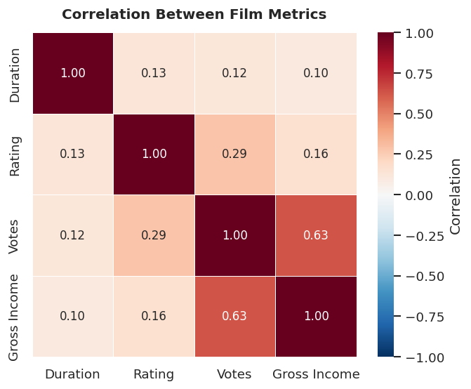
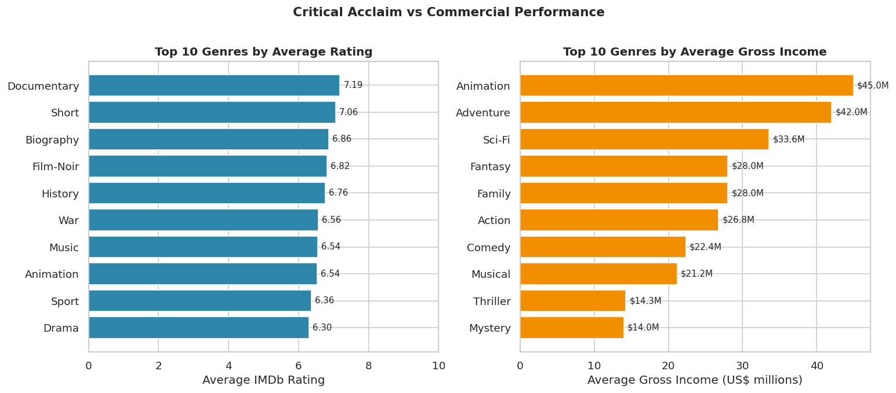
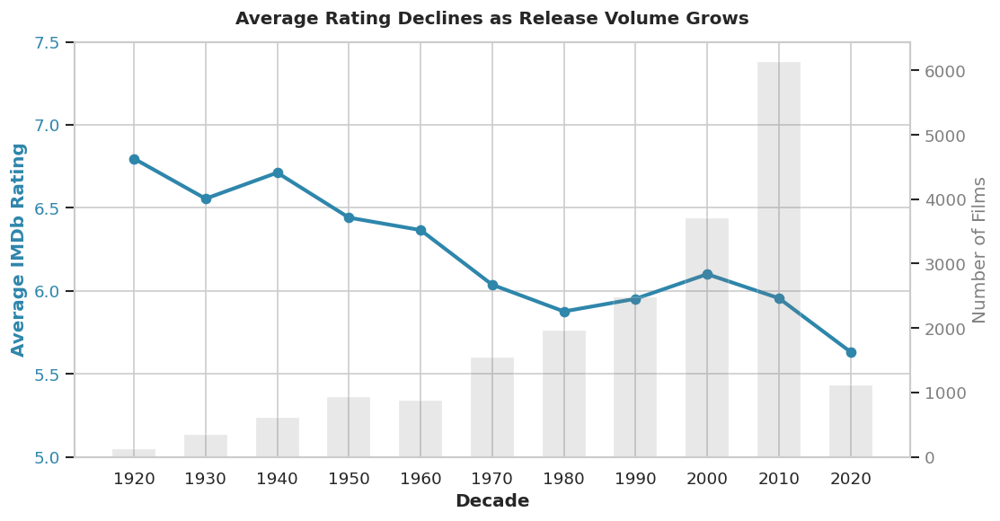
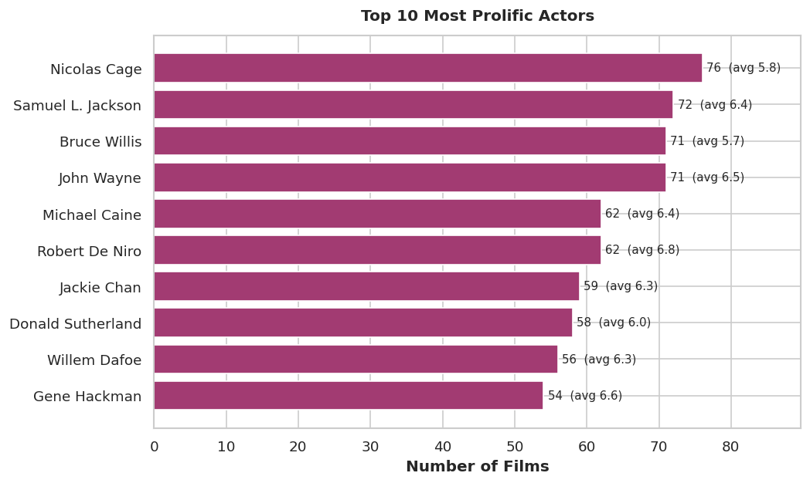

# IMDb Movie Data Analysis

Exploratory data analysis of 19,808 films examining what actually drives box-office revenue — critical acclaim or audience reach.

## Executive Summary

Conventional wisdom says good reviews sell tickets. The data says otherwise.

Across nearly 20,000 films, the number of user votes a movie receives correlates with gross revenue at **0.633**, while the IMDb rating itself correlates at only **0.159**. Audience reach is roughly four times more predictive of commercial performance than critical quality. A well-reviewed film that nobody talks about underperforms a mediocre film that everybody talks about.

## Dataset

The analysis uses `movies.csv` — 19,808 films with ratings, vote counts, revenue, cast, and crew. The file is included in this repository.

**Download:** [movies.csv](https://github.com/arsheenoberoi500-cell/imdb-movie-data-analysis/blob/main/movies.csv)

Or load it directly, no download needed:

```python
import pandas as pd

url = "https://raw.githubusercontent.com/arsheenoberoi500-cell/imdb-movie-data-analysis/main/movies.csv"
df = pd.read_csv(url)
```

## Key Findings

**Votes beat ratings, decisively**  
Vote count to gross revenue: **0.633** correlation. Rating to gross revenue: **0.159**. Visibility drives revenue; quality alone does not.

**Genre performance varies widely**  
Action and Adventure titles dominate on average gross, while Drama leads on volume of releases but trails significantly on revenue per film.

**Ratings have drifted across decades**  
Average ratings shift measurably by release decade, reflecting both changing production standards and the recency bias of an online voting audience.

**Steven Spielberg leads all directors by total gross**, with a filmography that consistently pairs wide release with high vote counts.

**Nicolas Cage is the most prolific actor in the dataset**, appearing in more titles than any other performer — though volume and average gross move in opposite directions.

## Visualizations

### Correlation Heatmap


### Genre Comparison


### Ratings by Decade


### Top Actors


## Analytical Approach

**Data engineering**
- Parsed and normalized inconsistent revenue formats into a single USD numeric column
- Split multi-value genre and cast fields into workable exploded structures
- Handled missing revenue and vote data through targeted filtering rather than blanket imputation
- Derived a decade column from release year for temporal grouping

**Analysis**
- Pearson correlation matrix across all numeric features to isolate revenue drivers
- Grouped aggregation by genre, decade, director, and actor
- Distribution analysis to confirm findings weren't driven by outlier blockbusters

## Tech Stack

- **Python 3**
- **pandas** — data manipulation and aggregation
- **NumPy** — numerical operations
- **Matplotlib** — plotting
- **Seaborn** — statistical visualization

## Running the Analysis

**Google Colab** (recommended, zero setup)  
Open `analysis.ipynb` in [Google Colab](https://colab.research.google.com/) and run all cells. The notebook loads the dataset directly from this repository.

**Jupyter Notebook** (local)
```bash
git clone https://github.com/arsheenoberoi500-cell/imdb-movie-data-analysis.git
cd imdb-movie-data-analysis
jupyter notebook analysis.ipynb
```

You'll need pandas, numpy, matplotlib, and seaborn installed.

## Repository Structure

```
imdb-movie-data-analysis/
├── analysis.ipynb
├── movies.csv
├── README.md
└── images/
    ├── heatmap.png
    ├── genre_comparison.png
    ├── ratings_by_decade.png
    └── top_actors.png
```

